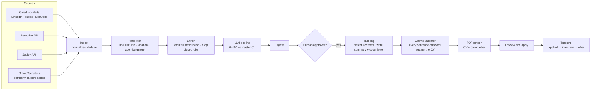

# job-agent

[](https://github.com/istrate-mihai/job-agent/actions/workflows/ci.yml)

**An LLM-powered job-search pipeline that finds, scores and tailors applications, with a human approving every one.**

I built this for my own job search as a full-stack developer in Romania. It collects postings from several sources, fetches missing job descriptions, scores each posting against my CV with an LLM, and — for postings I approve — generates a tailored CV and cover letter as PDFs. It never applies on its own: every application is reviewed and sent by me.

The interesting engineering problem is **making LLM output trustworthy enough to put on a CV**. The system never lets the model write CV bullets, validates every generated sentence against the source data, and falls back to safe defaults when validation fails.

---

## How it works



| Step | What happens | LLM? |
|---|---|---|
| **Ingest** | Pulls postings from Gmail alert emails (LLM extracts jobs from the email), Remotive, Jobicy and SmartRecruiters. Normalizes them and deduplicates across sources. | extraction only |
| **Hard filter** | Title include/exclude lists, target cities (home city, remote, relocation cities), posting age, blocklisted companies, required languages (English + Romanian wording). Free and deterministic. | no |
| **Enrich** | Job-alert emails contain only a title. This step fetches the full description (schema.org `JobPosting` JSON-LD or the page's description block), detects closed or expired postings, and queues re-scoring. | no |
| **Score** | The LLM rates must-have coverage, stack overlap, seniority fit and goal alignment. **The total is computed in code**, plus deterministic location points and penalties (e.g. a required language the candidate doesn't speak caps the score). | yes |
| **Tailor** | For approved postings only. The LLM **selects** bullet IDs from the master CV and writes a summary and a cover letter; code enforces layout rules and validates every claim. | yes |
| **Render** | HTML → PDF with Playwright; content is trimmed (least relevant first) until the CV fits two pages. | no |
| **Track** | Status history, a per-company cooldown, and follow-up reminders after 7 days without a reply. | no |

---

## Design decisions

### "Select, don't generate"
CV bullets are **never written by the model**. The master CV (`data/master-cv.json`) is a bank of facts, each with an ID, skills and evidence links. The model returns IDs; the renderer prints the original text verbatim. Unknown or misplaced IDs are dropped or re-routed in code, so nothing outside the fact bank can reach the PDF.

### Claims validator (hallucination guard)
The only free text the model writes — the summary and cover letter — is validated **sentence by sentence**:
- technologies not evidenced anywhere in the CV are rejected (a lexicon of ~100 common technologies);
- every number must exist in the CV (so "improved performance by 45%" can't be invented);
- skills marked `training` (courses, not job experience) may only appear in a learning context ("completing a DevOps program covering Kubernetes");
- honest gap statements are allowed ("I have not used Nest.js in production yet"), including quoting the posting's own requirement ("shorter than the 6–9 years you list");
- summary style rules: no first person, no self-praise ("expert"), no copying 7+ words from the posting, no returning the base summary unchanged.

Failures get **one repair round** with the exact problems fed back to the model; if it fails again, the summary falls back to the untouched base text and the letter to a safe template, flagged for manual editing.

### Provider router with fallbacks
Every LLM call goes through a router configured per task (`extraction`, `scoring`, `tailoring`):
- routes are tried in order (e.g. Groq → Gemini → local Ollama → Anthropic); routes without an API key are skipped;
- structured output via forced tool calls, validated with Zod; if a model fails to produce a valid tool call, the same model is retried in plain JSON mode;
- 429/503 responses are retried after the provider's `retry-after` (also parsed from the error body), within a wait budget; long waits move to the next route;
- reasoning effort is configurable, because reasoning models spend the output-token budget on hidden thinking;
- a daily token budget and a kill switch are checked before every call, and all usage is logged to Postgres.

It runs entirely on **free tiers** (Groq, Gemini); paid models can be enabled per task in the config.

### Prompt-injection isolation
Job postings and emails are third-party text. They are passed as delimited data, the prompts tell the model to ignore instructions inside them, and every output is schema-validated — the model can only return IDs, scores and text that then goes through the validator. No step lets model output trigger actions.

### Human in the loop
Scoring and tailoring only prepare decisions. Postings are approved or skipped by hand (`decide`), each decision is stored with its score for later calibration, and applications are submitted manually.

### Privacy
Contact details (name, email, phone, links) are never sent to LLM providers; they're added only when the PDF is rendered locally. `data/`, `secrets/`, `output/` and `.env` are gitignored.

---

## Tech stack

- **TypeScript** (strict, `noUncheckedIndexedAccess`, `exactOptionalPropertyTypes`), Node.js, `tsx`
- **PostgreSQL 16** in Docker, **Drizzle ORM** + drizzle-kit migrations
- **Zod** for config, CV schema, API responses and LLM outputs
- **LLMs:** Groq (gpt-oss), Google Gemini, Anthropic, Ollama — via an OpenAI-compatible adapter + Anthropic SDK
- **Gmail API** (read-only OAuth) for job-alert ingestion
- **Playwright** (Chromium / installed Edge or Chrome) + **pdf-lib** for PDF rendering
- **node-html-parser** for description extraction

---

## Project structure

```text
config/search-config.yaml   what to search: sources, titles, locations, LLM routes, thresholds
data/master-cv.json         the fact bank (gitignored) — the only source of CV content
src/
  ingest/        sources (gmail, remotive, jobicy, smartrecruiters, greenhouse, lever, workable, recruitee, personio, job-board pages), enrichment
  filter/        deterministic hard filter
  llm/           provider router, OpenAI-compatible + Anthropic adapters, usage logging
  scoring/       LLM fit scoring (total computed in code)
  tailoring/     fact selection, summary + cover letter, claims validator, review diff
  cv/            CV view model, HTML templates, PDF rendering, file naming
  db/            Drizzle schema and client
  scripts/       CLI entry points (ingest, enrich, score, digest, decide, tailor, track, …)
```

---

## Getting started

**Prerequisites:** Node.js 22+, Docker, a free [Groq](https://console.groq.com) and/or [Gemini](https://aistudio.google.com) API key.

```bash
git clone https://github.com/istrate-mihai/job-agent.git && cd job-agent
npm ci
cp .env.example .env            # set POSTGRES_PASSWORD / DATABASE_URL and at least one LLM key
npm run db:up && npm run db:migrate
```

Create `data/master-cv.json` following the schema in `src/schemas/masterCv.ts` (a complete fictional example lives in `tests/fixtures/sample-cv.json`), then check it:

```bash
npm run validate:cv
npm run cv:base                 # renders your untailored CV to output/
```

Optional: Gmail alert ingestion needs a Google Cloud OAuth client (`secrets/gmail-credentials.json`), then `npm run gmail:auth`.

Try the whole flow without real postings:

```bash
npm run simulate                # inserts 3 fictional postings
npm run score && npm run digest
npm run decide -- <id> approve "demo"
npm run tailor                  # writes CV + cover letter PDFs to output/applications/
npm run simulate -- --clean
```

---

## Daily use

```bash
npm run db:up && npm run pipeline         # ingest → enrich → score → digest
npm run decide -- <id> approve "reason"   # or skip
npm run tailor                            # tailored CV + cover letter for approved postings
npm run track -- <id> applied "where"     # after submitting
npm run track                             # board + follow-up reminders
```

Output per application:

```text
output/applications/<date>_<company>_<title>_<id>/
  <Surname>_<Given_Names>_<Job_Title>_<Company>_CV.pdf
  <Surname>_<Given_Names>_<Job_Title>_<Company>_Cover_Letter.pdf
  <Surname>_<Given_Names>_<Job_Title>_<Company>_Cover_Letter.txt
  diff.md          what changed vs the base CV, posting requirements vs CV evidence, validator results
```

Other commands: `refilter` (re-apply filter rules after config changes), `describe` (add a description by hand), `llm:models` (check which model IDs your keys can use), `gmail:check` (diagnose alert senders).

---

## Testing

```bash
npm test            # 63 unit tests, no database, network or API keys needed
npm run typecheck
```

The suite runs on every push via GitHub Actions and covers the parts where a bug would put something false on a CV or waste an application:

| Area | What is verified |
|---|---|
| Claims validator | invented technologies and numbers rejected; `JavaScript` ≠ `Java`; training-only skills only in a learning context; honest gap statements allowed |
| Summary style | self-praise, first person, copying the posting and unchanged base text are rejected |
| Tailoring | unknown bullet IDs dropped, misplaced IDs re-routed, retry after a rejected claim, safe fallback after two failures, no assumptions for title-only postings |
| LLM router | JSON-mode retry after a broken tool call, rate-limit waits parsed from the error body, fallback to the next route, 503 retries, repair prompts, budget stop before any call |
| Hard filter | location tiers and aliases, remote scope, title include/exclude, stale vs long-open postings, required languages in English and Romanian |
| Enrichment | LinkedIn description extraction, closed/removed/throttled detection, JSON-LD `JobPosting` in `@graph`, expired `validThrough` |
| Coverage report | versioned requirements (`Vue.js 3+`), synonyms (`unit testing` ↔ PHPUnit), years vs CV claims, real gaps |
| Privacy | the LLM profile never contains name, email, phone or links |

Tests use a fictional CV and config (`tests/fixtures/`) and stub `fetch`, so they never touch real providers or your data.

## Limitations and responsible use

- **LinkedIn enrichment** reads LinkedIn's public, logged-out job pages. LinkedIn's terms don't allow automated access; this is optional (`enrich.linkedin: false`), low-volume (sequential, delayed, capped per run), uses no account, and stops on the first throttling response.
- Free LLM tiers have tight per-minute limits; tailoring pauses between postings and retries through rate limits, but a batch can take several minutes.
- Scores are a triage aid, not a verdict — decisions are stored so the scoring can be calibrated against them.
- The validator reduces, but can't fully eliminate, misleading text: every letter and CV is reviewed before it's sent.

## Roadmap

- Calibration report: scores vs. approve/skip decisions
- Small web dashboard for review and tracking
