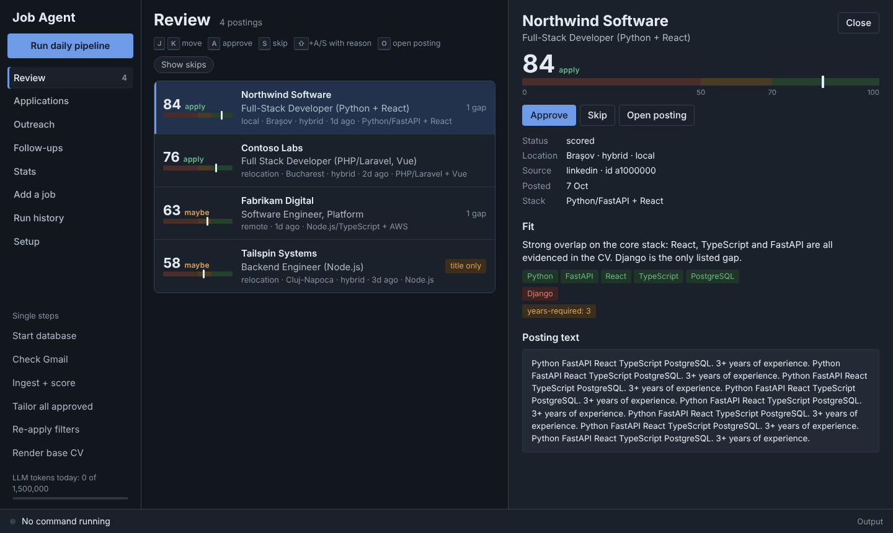
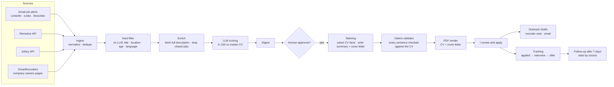
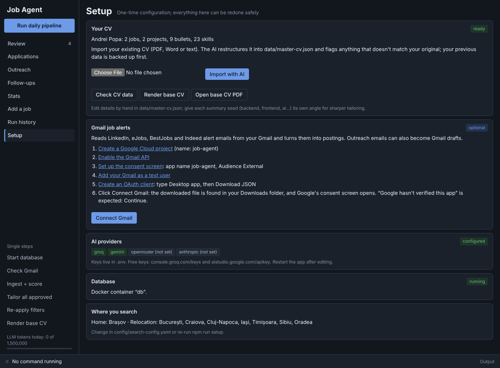

# job-agent

[](https://github.com/istrate-mihai/job-agent/actions/workflows/ci.yml)

**An LLM-powered job-search pipeline that finds, scores and tailors applications, with a human approving every one.**

I built this for my own job search as a full-stack developer in Romania. It collects postings from several sources, fetches missing job descriptions, scores each posting against my CV with an LLM, and — for postings I approve — generates a tailored CV and cover letter as PDFs, drafts messages to the recruiter, and reminds me to follow up. It never applies or sends anything on its own: every application and message is reviewed and sent by me.

It runs locally with a browser GUI, installs with one double-click on Windows, needs no Docker, and works on free LLM tiers.



The interesting engineering problem is **making LLM output trustworthy enough to put on a CV**. The system never lets the model write CV bullets, validates every generated sentence against the source data, and falls back to safe defaults when validation fails.

---

## How it works



| Step | What happens | LLM? |
|---|---|---|
| **Ingest** | Pulls postings from Gmail alert emails (LLM extracts jobs from the email), Remotive, Jobicy and SmartRecruiters. Normalizes them and deduplicates across sources. | extraction only |
| **Hard filter** | Title include/exclude lists, target cities (home city, remote, relocation cities), posting age, blocklisted companies, required languages (English + Romanian wording), "US/Canada residents only" style restrictions, and required years of experience parsed from the text. Free and deterministic. | no |
| **Enrich** | Job-alert emails contain only a title. This step fetches the full description (schema.org `JobPosting` JSON-LD or the page's description block), detects closed or expired postings, and queues re-scoring. | no |
| **Score** | The LLM rates must-have coverage, stack overlap, seniority fit and goal alignment. **The total is computed in code**, plus deterministic location points and penalties (e.g. a required language the candidate doesn't speak caps the score). | yes |
| **Tailor** | For approved postings only. The LLM **selects** bullet IDs from the master CV and writes a summary and a cover letter; code enforces layout rules and validates every claim. | yes |
| **Render** | HTML → PDF with Playwright; content is trimmed (least relevant first) until the CV fits two pages. | no |
| **Outreach** | Drafts a LinkedIn connection note (≤200 chars), a LinkedIn message and an email to a recruiter or hiring manager, with search links to find the person; optionally a Gmail draft with the CV attached. Same claims validator as the letter. | yes |
| **Track** | Status history, a per-company cooldown, follow-up texts after 7 days without a reply (max two), and reply-rate stats by source, score band, location and outreach vs. ATS-only. | no |

---

## Design decisions

### "Select, don't generate"
CV bullets are **never written by the model**. The master CV (`data/master-cv.json`) is a bank of facts, each with an ID, skills and evidence links. The model returns IDs; the renderer prints the original text verbatim. Unknown or misplaced IDs are dropped or re-routed in code, so nothing outside the fact bank can reach the PDF.

### Claims validator (hallucination guard)
The only free text the model writes — the summary and cover letter — is validated **sentence by sentence**:
- technologies not evidenced anywhere in the CV are rejected (a lexicon of ~100 common technologies);
- every number must exist in the CV (so "improved performance by 45%" can't be invented);
- skills marked `training` (courses, not job experience) may only appear in a learning context ("completing a DevOps program covering Kubernetes");
- honest gap statements are allowed ("I have not used Nest.js in production yet"), including quoting the posting's own requirement ("shorter than the 6–9 years you list");
- summary style rules: no first person, no self-praise ("expert"), no copying 7+ words from the posting, no returning the base summary unchanged.

Failures get **one repair round** with the exact problems fed back to the model; if it fails again, the summary falls back to the untouched base text and the letter to a safe template, flagged for manual editing.

### Provider router with fallbacks
Every LLM call goes through a router configured per task (`extraction`, `scoring`, `tailoring`):
- routes are tried in order (e.g. Groq → Gemini → local Ollama → Anthropic); routes without an API key are skipped;
- structured output via forced tool calls, validated with Zod; if a model fails to produce a valid tool call, the same model is retried in plain JSON mode;
- 429/503 responses are retried after the provider's `retry-after` (also parsed from the error body), within a wait budget; long waits move to the next route;
- reasoning effort is configurable, because reasoning models spend the output-token budget on hidden thinking;
- a daily token budget and a kill switch are checked before every call, and all usage is logged to Postgres.

It runs entirely on **free tiers** (Groq, Gemini); paid models can be enabled per task in the config.

### Prompt-injection isolation
Job postings and emails are third-party text. They are passed as delimited data, the prompts tell the model to ignore instructions inside them, and every output is schema-validated — the model can only return IDs, scores and text that then goes through the validator. No step lets model output trigger actions.

### Cover letters that read like a person wrote them
Besides the claims check, letters are rejected for third person ("the candidate…"), for volunteering unmet requirements ("…which is not present in my CV": gaps are prepared for the interview in `diff.md`, never written into the application) and for clichés. The same rules apply to outreach messages.

### Human in the loop
Scoring and tailoring only prepare decisions. Postings are approved or skipped by hand (`decide`), each decision is stored with its score for later calibration, and applications are submitted manually.

### Privacy
Contact details (name, email, phone, links) are never sent to LLM providers; they're added only when the PDF is rendered locally. `data/`, `secrets/`, `output/` and `.env` are gitignored.

---

## Tech stack

- **TypeScript** (strict, `noUncheckedIndexedAccess`, `exactOptionalPropertyTypes`), Node.js, `tsx`
- **PostgreSQL**: built in via `embedded-postgres` (no Docker), or Docker / your own server; **Drizzle ORM** + drizzle-kit migrations
- **Zod** for config, CV schema, API responses and LLM outputs
- **LLMs:** Groq (gpt-oss), Google Gemini, Anthropic, Ollama — via an OpenAI-compatible adapter + Anthropic SDK
- **Gmail API** (OAuth: read + drafts) for job-alert ingestion and outreach drafts
- **GUI:** Node `http` server + vanilla JS, no framework or build step; buttons run the same CLI scripts
- **unpdf** + **mammoth** for CV import from PDF / Word
- **Playwright** (Chromium / installed Edge or Chrome) + **pdf-lib** for PDF rendering
- **node-html-parser** for description extraction

---

## Project structure

```text
config/search-config.yaml   what to search: sources, titles, locations, LLM routes, thresholds
data/master-cv.json         the fact bank (gitignored) — the only source of CV content
src/
  ingest/        sources (gmail, remotive, jobicy, smartrecruiters, greenhouse, lever, workable, recruitee, personio, RSS feeds, job-board pages), enrichment
  filter/        deterministic hard filter
  llm/           provider router, OpenAI-compatible + Anthropic adapters, usage logging
  scoring/       LLM fit scoring (total computed in code)
  tailoring/     fact selection, summary + cover letter, claims validator, review diff
  cv/            CV view model, HTML templates, PDF rendering, file naming
  outreach/      recruiter messages, search links, follow-ups, Gmail drafts
  reporting/     reply-rate stats and due follow-ups (shared by CLI and GUI)
  ui/            local GUI server, whitelisted command runner, static frontend
  db/            Drizzle schema and client, database start/stop (embedded / Docker / external)
  scripts/       CLI entry points (setup, ingest, enrich, score, digest, decide, tailor, track, outreach, …)
install.cmd, install.sh      one-step installers (Node.js, packages, setup wizard)
start-job-agent.cmd / .sh    launcher behind the desktop shortcut
```

---

## Getting started

### What you need
- A computer with **Windows 10/11**, macOS or Linux
- About **10 minutes** and an internet connection (the installer downloads about 300 MB)
- A free **Groq** API key (no card needed): sign in at [console.groq.com/keys](https://console.groq.com/keys) → **Create API Key** → copy it.
  A [Gemini key](https://aistudio.google.com/apikey) works too; having both makes the app more reliable.
- Your current **CV** as PDF or Word (.docx)

You don't need Docker, git or any programming tools: the installer sets up everything else.

### Install on Windows

1. **Download the app.** At the top of this page click the green **Code** button → **Download ZIP**.
2. **Extract it.** Right-click the downloaded `job-agent-main.zip` → **Extract All…** → choose a permanent place,
   for example `Documents`. (Don't run it from inside the zip or from the Downloads folder you clean up.)
3. **Run the installer.** Open the extracted `job-agent-main` folder and double-click **`install.cmd`**.
   - If Windows shows *"Windows protected your PC"*: click **More info** → **Run anyway**
     (it appears for any script downloaded from the internet).
   - If Node.js isn't installed, the installer installs it and may ask for administrator permission.
     If it then says Node.js isn't on PATH yet, close the window and double-click `install.cmd` again.
4. **Answer the setup questions** in the black window. Press Enter to accept the default in `[brackets]`:

   | Question | What to answer |
   |---|---|
   | Use Docker for the database? *(only asked if Docker is installed)* | **N**: the built-in database needs nothing else |
   | Groq API key / Gemini API key | paste the key (right-click pastes in the window), Enter to skip one |
   | Change cities? | **y**, then your city, the cities you'd move to, one line about the roles you want |
   | Path to your CV | drag your CV file into the window, then Enter |
   | Create a desktop icon? | **Y** |
   | Connect Gmail now? | **N** for now (optional, see below) |

5. **Start it.** Double-click **Job Agent** on your desktop. A small window opens (leave it open; closing it stops
   the app) and the app opens in your browser at http://localhost:5174.

### Install on macOS / Linux

```bash
git clone https://github.com/istrate-mihai/job-agent.git && cd job-agent && ./install.sh
```

Or download the ZIP as above, extract it, open a terminal in the folder and run `./install.sh`.
The installer offers to install Node.js with Homebrew, or explains how to install it with nvm.

### First steps in the app

1. **Setup** page → check that your CV was imported. Read the warnings: the AI only restructures your CV, and anything
   that doesn't match your original is listed there. Click **Render base CV** and compare the PDF with your own CV.
2. Click **Run daily pipeline** (top left). It collects postings and scores them; the first run takes a few minutes.
3. **Review** page: press **A** to approve a posting, **S** to skip it.
4. **Applications** page: **Tailor CV + letter** → open the PDFs → apply on the company's site → **Mark applied**.

Every CV line and cover-letter claim comes only from your CV data (`data/master-cv.json`), so it's worth reviewing once.
You can re-import any time from the Setup page or with `npm run cv:import -- path/to/cv.pdf` (the old file is backed up).

### Gmail job alerts (optional, 5 minutes)



With Gmail connected, alert emails from LinkedIn, eJobs, BestJobs and Indeed become postings automatically, and
recruiter emails can be saved as Gmail drafts. Google requires your own small (free) Cloud project for this.
In the app: **Setup → Gmail job alerts** shows the five steps with direct links:

1. Create a Google Cloud project (name it `job-agent`)
2. Enable the Gmail API
3. Set up the consent screen: app name `job-agent`, Audience **External**
4. Add your own Gmail address as a **test user**
5. Create an OAuth client of type **Desktop app** and click **Download JSON**

Then click **Connect Gmail**: the app finds the downloaded file in your Downloads folder and opens Google's consent
screen. Google shows *"Google hasn't verified this app"*: that's expected for your own app → **Continue**.
In the terminal the same guide runs with `npm run gmail:setup`.

While the Google app is in *Testing*, Google expires the connection every 7 days. To avoid reconnecting weekly:
Google Cloud console → **Audience** → **Publish app** → Confirm.

Then create job alerts that go to that Gmail: LinkedIn (saved search → *Set alert*), eJobs, BestJobs, Hipo, Indeed.

### Update to a new version

- **Installed with git:** `git pull && npm ci && npm run db:migrate`
- **Installed from the ZIP:** download and extract the new ZIP to a new folder. Close the Job Agent window, then copy
  these from the old folder into the new one: `.env`, `data`, `secrets`, `output` and `.pgdata` (the last is hidden;
  in Explorer enable *View → Show → Hidden items*). Then double-click `install.cmd` in the new folder.

Your data never leaves your computer except for the posting text and CV facts sent to the AI provider you chose:
name, email, phone and links are never sent.

### Troubleshooting

| Problem | Fix |
|---|---|
| "This folder is not a complete Job Agent install" | You ran an incomplete copy. Download the whole ZIP from the green **Code** button again. |
| The app says the database isn't running | Setup page → **Start database**, or run `npm run db:up` in the app folder |
| Scoring or tailoring fails with "All LLM routes failed" | The API key is missing or wrong: open `.env` in the app folder with Notepad, fix `GROQ_API_KEY=`, restart the app |
| PDFs don't render (macOS/Linux) | `npx playwright install chromium` |
| Gmail stopped working after a week | Publish the Google app (see Gmail above), then Setup → **Reconnect** |
| Port 5174 is in use | Start with `UI_PORT=5180 npm run ui` |

### For developers

Manual install: Node.js 22+, `npm ci`, `npm run setup`. Database: `npm run db:up` / `db:down` / `db:status`;
`DB_MODE` in `.env` selects `embedded` (built-in PostgreSQL in `.pgdata/`), `docker` or `external` (your own server).

Try the whole flow without real postings:

```bash
npm run simulate                # inserts 3 fictional postings
npm run score && npm run digest
npm run decide -- <id> approve "demo"
npm run tailor                  # writes CV + cover letter PDFs to output/applications/
npm run simulate -- --clean
```

---

## Daily use

### GUI

```bash
npm run ui        # opens http://localhost:5174 — keep the terminal open, Ctrl+C to stop
```

Or double-click the **Job Agent** desktop shortcut (`npm run shortcut` creates it): it starts the database and opens the app.

Everything below is also a button in the GUI: daily run, review with keyboard (J/K move, A approve, S skip,
Shift+A/S with a reason, O open posting, 1-8 switch views), tailoring, status changes, pasting a missing description,
recruiter outreach, follow-ups, stats, adding a job, and the Setup page (CV import, Gmail, keys, database). Buttons run the same scripts as the terminal, one at a time,
with their output in the bottom panel. The server listens on 127.0.0.1 only. `UI_PORT=5180 npm run ui` changes the port.

### Terminal

```bash
npm run db:up && npm run pipeline         # ingest → enrich → score → digest
npm run decide -- <id> approve "reason"   # or skip
npm run tailor                            # tailored CV + cover letter for approved postings
npm run track -- <id> applied "where"     # after submitting
npm run track                             # board + follow-up reminders
npm run outreach                          # tailored/applied postings with no recruiter contacted yet
npm run outreach -- <id> --role recruiter --to "Ana Pop" [--email ana@firma.ro]
                                          # connection note + LinkedIn message + email (Gmail draft with CV attached)
npm run outreach -- sent <id> message     # after you send it (connect|message|email); `replied <id>` when they answer
npm run followup                          # applied 7+ days, no answer → ready follow-up texts; `followup -- <id> sent`
npm run stats                             # reply rate by source, score band, location, outreach vs ATS-only
```

Outreach is drafted, never sent automatically: LinkedIn has no messaging API and automated messages get accounts
restricted, and every message passes the same evidence validator as the cover letter (no invented tech, numbers or
third-person text). `--email` needs Gmail connected: `npm run gmail:setup`.

Output per application:

```text
output/applications/<date>_<company>_<title>_<id>/
  <Surname>_<Given_Names>_<Job_Title>_<Company>_CV.pdf
  <Surname>_<Given_Names>_<Job_Title>_<Company>_Cover_Letter.pdf
  <Surname>_<Given_Names>_<Job_Title>_<Company>_Cover_Letter.txt
  diff.md          what changed vs the base CV, posting requirements vs CV evidence, validator results
```

Other commands: `refilter` (re-apply filter rules after config changes), `describe` (add a description by hand), `llm:models` (check which model IDs your keys can use), `gmail:check` (diagnose alert senders).

---

## Testing

```bash
npm test            # 109 unit tests, no database, network or API keys needed
npm run typecheck
```

The suite runs on every push via GitHub Actions and covers the parts where a bug would put something false on a CV or waste an application:

| Area | What is verified |
|---|---|
| Claims validator | invented technologies and numbers rejected; `JavaScript` ≠ `Java`; training-only skills only in a learning context; honest gap statements allowed |
| Summary style | self-praise, first person, copying the posting and unchanged base text are rejected |
| Tailoring | unknown bullet IDs dropped, misplaced IDs re-routed, retry after a rejected claim, safe fallback after two failures, no assumptions for title-only postings |
| LLM router | JSON-mode retry after a broken tool call, rate-limit waits parsed from the error body, fallback to the next route, 503 retries, repair prompts, budget stop before any call |
| Hard filter | location tiers and aliases, remote scope, title include/exclude, stale vs long-open postings, required languages in English and Romanian |
| Enrichment | LinkedIn description extraction, closed/removed/throttled detection, JSON-LD `JobPosting` in `@graph`, expired `validThrough` |
| Coverage report | versioned requirements (`Vue.js 3+`), synonyms (`unit testing` ↔ PHPUnit), years vs CV claims, real gaps |
| Eligibility | "USA & Canada only", "must be US-based", clearance requirements blocked; years required parsed, nice-to-haves and company boilerplate ignored |
| Letters + outreach | third person, admitted gaps and clichés rejected; LinkedIn length limits; invented technology repaired; MIME drafts safe against header injection |
| CV import | dates in any format, CEFR mapping, training skills kept apart, invented numbers flagged, PDF/TXT extraction, scanned PDFs refused |
| Privacy | the LLM profile never contains name, email, phone or links |

Tests use a fictional CV and config (`tests/fixtures/`) and stub `fetch`, so they never touch real providers or your data.

## Limitations and responsible use

- **LinkedIn enrichment** reads LinkedIn's public, logged-out job pages. LinkedIn's terms don't allow automated access; this is optional (`enrich.linkedin: false`), low-volume (sequential, delayed, capped per run), uses no account, and stops on the first throttling response.
- Free LLM tiers have tight per-minute limits; tailoring pauses between postings and retries through rate limits, but a batch can take several minutes.
- Scores are a triage aid, not a verdict — decisions are stored so the scoring can be calibrated against them.
- The validator reduces, but can't fully eliminate, misleading text: every letter and CV is reviewed before it's sent.

## Roadmap

- Calibration report: scores vs. approve/skip decisions
- Repair the job boards that now render with JavaScript (devjob, juniors, talent)
- Edit the CV data from the GUI instead of the JSON file
